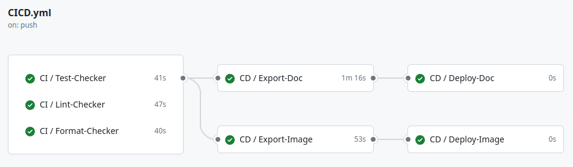

# FastAPI Microservice (Py)

[](https://github.com/u-ways/fastapi-microservice-py/actions/workflows/CICD.yml)
[](https://python-poetry.org/)
[](https://www.python.org/downloads/release/python-3110/)
[](./LICENSE)
[](https://flake8.pycqa.org/en/latest/)
[](https://github.com/psf/black)

- [Background](#background)
- [Getting Started](#getting-started)
    - [Prerequisites](#prerequisites)
    - [Running the Project](#running-the-project)
- [OpenAPI Specification](#openapi-specification)
  - [Published Documentation](#published-documentation)
  - [Live-Reload Documentation](#live-reload-documentation)
- [Running via Docker](#running-via-docker)
    - [Build Stages](#build-stages)
    - [Available Commands](#available-commands)
- [Contributing](#contributing)

## Background

This is a microservice project template for Python. It is intended to demonstrate a production-grade microservice in
Python with a maintainable structure, optimised containerisation, build automation and a CI/CD pipeline. The project is
using [FastAPI](https://fastapi.tiangolo.com/) which is a modern, fast (high-performance), web framework for building
APIs with standard Python type hints.

The project focus on maintainability and testability. It is built with [Poetry](https://python-poetry.org/),
linted with [Flake8](https://flake8.pycqa.org/en/latest/), and formatted
with [Black](https://black.readthedocs.io/en/stable/) to ensure code quality and consistency.

The automation tool of choice for this project is [Make](https://www.gnu.org/software/make/), which provides a simple
and cross-platform way to run common tasks such as installing dependencies, building the project, running tests, etc.
This is coupled with an advanced multistage [docker](https://www.docker.com/) build to ensure the project can be
completely built and run in an isolated deployment environment in a consistent manner.

## Getting Started

### Prerequisites

- [Python](https://www.python.org/downloads/): The project is built with Python 3.11.
- [Poetry](https://python-poetry.org/docs/#installing-with-the-official-installer): The dependency management tool of
  choice for this project.
- [Docker](https://docs.docker.com/engine/install/): For containerisation support, so it can be completely built and run
  in an isolated environment.
- [Make](https://www.gnu.org/software/make/): For running common tasks such as installing dependencies, building the
  project, running tests, etc.

### Running the Project

1. Clone the repository:

   ```bash
   git clone https://github.com/u-ways/fastapi-microservice-py.git
   ```

2. At the root of the project, build the project:

   ```bash
   make install-dependencies
   make build-app
   ```

3. Run the project:

   ```bash
    make run-app
    ```

## OpenAPI Specification

### Published Documentation

At the end of a successful CI/CD pipeline, the OpenAPI documentation is published to GitHub Pages. You can access the
documentation via the following
link: [https://u-ways.github.io/fastapi-microservice-py/](https://u-ways.github.io/fastapi-microservice-py/)

### Live-Reload Documentation

The FastAPI framework provides a
great [self-documenting feature](https://fastapi.tiangolo.com/features/#based-on-open-standards)
that automatically generates an OpenAPI compliant documentation for your API endpoints, by default, two documentation
interfaces are available:

- Swagger UI: [http://0.0.0.0:8000/docs](http://0.0.0.0:8000/docs)
- ReDoc: [http://0.0.0.0:8000/redoc](http://0.0.0.0:8000/redoc)

You can also access the JSON schema of the OpenAPI documentation via:

```bash
curl -s http://0.0.0.0:8000/openapi.json | jq
```

To learn more about how you can extend the generated OpenAPI documentation, you can check the official guide
here: [FastAPI - Learn - How To - Recipes - Extending OpenAPI](https://fastapi.tiangolo.com/how-to/extending-openapi/).

## Running via Docker

#### Build Stages

You can also run the project using Docker. Our Dockerfile is a multi-stage build based on the official slimmed down
Python image. It's divided into the following stages:

| Layer | Name         | Description                                                                                                                                                                                                  |
|-------|--------------|--------------------------------------------------------------------------------------------------------------------------------------------------------------------------------------------------------------|
| 1     | PYTHON-BASE  | Configures the base image environment variables.                                                                                                                                                             |
| 2     | BUILDER-BASE | Installs Poetry, and then loads the project dependencies with caching enabled.                                                                                                                               |
| 3     | DEVELOPMENT  | Relies on the `BUILDER-BASE` to pull in the dependencies, as such this layer focus on testing and running the project in development mode.                                                                   |
| 4     | PRODUCTION   | This stage is the final image that is used to run the project in a production environment. It creates a hard copy of the project dependencies and source code, and then runs the project in production mode. |

This enables you to build and run the project in an isolated environment with all the dependencies and configurations
bundled together without diverging image builds when you switch between development and production environments.

#### Available Commands

To test the Docker build, you can run the following commands:

```bash
make test-app-docker
```

To build and run the project in a development environment:

```bash
make run-app-docker-dev
```

To build and run the project in a production environment:

```bash
make run-app-docker-prod
```

## Contributing

Although this is more of an educational/demo project, I am open to contributions. If you have any suggestions or
improvements, feel free to open a PR or an issue. The build and development process has been made to be as seamless as
possible, so you can easily run and test your changes locally before submitting a PR.



On top of that, the CI/CD pipeline is configured to run the tests, formater and linter on every PR, so you can be sure
that your changes are in line with the project standards. You can also run our code quality checks locally by running:

```bash
make check-code-quality
```

You can also run the linting and formatting actions to resolve any issues:

```bash
make format-code && make lint-code
```

___
